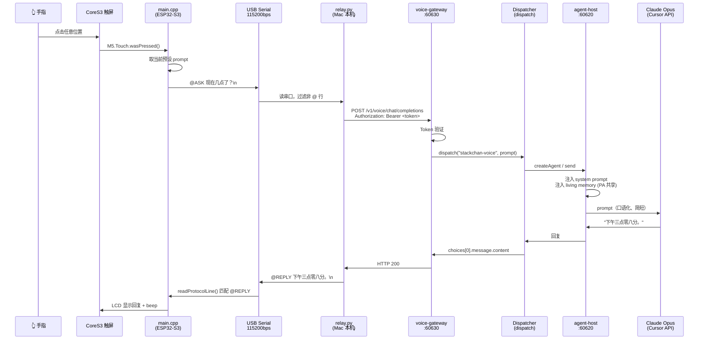
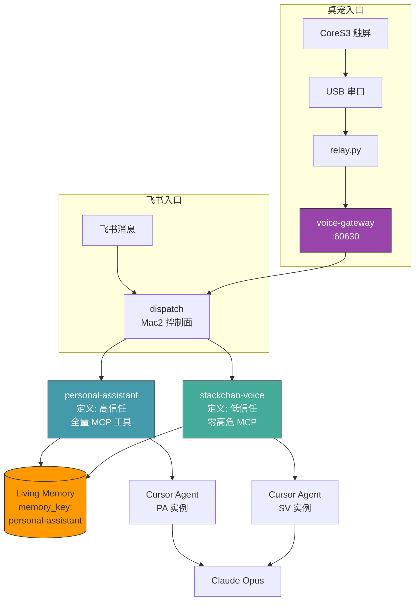

# StackChan Agent — 创造追踪画布

_Last updated: 2026-07-07_

## 一、整条调用链



## 二、Agent 身份图谱



## 三、文件清单

| 层级 | 文件 | 说明 |
|------|------|------|
| **固件** | `src/main.cpp` | 触控 → 串口协议 → 显示，零网络 |
| **配置** | `include/config.h` (gitignored) | USB 串口参数 |
| **中继** | `tools/relay.py` | 串口 ↔ HTTP 桥，自动重连 |
| **网关** | `dispatch/src/voice-gateway.ts` | OpenAI-compatible 端点 |
| **网关服务** | `dispatch/src/voice-gateway-serve.ts` | 独立 Express server |
| **校验** | `dispatch/src/voice-gateway-check.ts` | 22 项 mock 断言 |
| **Agent 定义** | `dispatch/config.yaml` | stackchan-voice 定义 |
| **信任模型** | `dispatch/src/logic-check.ts` | testVoiceTrustModel() |
| **扩展点** | `dispatch/src/config.ts` | memory_key 字段 |
| **路由** | `dispatch/src/dispatcher.ts` | memory_key 注入 |
| **面板** | `dispatch/src/dashboard.ts` | gateway 挂载（token gate 之前） |
| **画布** | `CANVAS.md` | 本文件 |

## 四、信任模型（design.md D6）

```
                  ┌─────────────────────────────┐
                  │      personal-assistant      │
                  │  ✅ filesystem               │
                  │  ✅ ask-agent (内部通信)       │
                  │  ✅ notify_user (推送)        │
                  │  ✅ self-mod (改自己代码)      │
                  │  ✅ shell (任意命令)           │
                  │  🧠 高信任：飞书账号认证        │
                  └─────────────────────────────┘

                  ┌─────────────────────────────┐
                  │      stackchan-voice          │
                  │  ✅ filesystem (读取项目)      │
                  │  ❌ ask-agent（未挂载）        │
                  │  ❌ notify_user（未挂载）      │
                  │  ❌ self-mod（未挂载）         │
                  │  ❌ shell（未挂载）            │
                  │  🧠 低信任：旁边任何人都能说     │
                  │  📦 共享 PA 的 living memory   │
                  └─────────────────────────────┘
```

信任是**定义级**的，不由每次请求决定——`stackchan-voice` 的 `mcp_servers` 字段为空，挂不上危险工具。

## 五、进度

| 组 | 内容 | 状态 |
|---|---|---|
| G1: Voice Gateway | gateway + gateway-serve + logic-check | ✅ 完成 |
| G2: 固件 + 串口 | main.cpp + relay.py + USB 直连 | ✅ 完成，已验证 live |
| G3: Agora ConvoAI | 实时语音管线 | ❌ 未开始 |
| G4: L0 具身 | 表情/LED/舵机 | ❌ 未开始 |
| G5: 语音输出 | CoreS3 扬声器 TTS | ❌ 未开始 |
| G6: 主动关注 | agent 主动打招呼 | ❌ 未开始 |
| G7: 运维 | PM2 持久化 relay + gateway | ✅ 完成 |

## 六、运维（PM2 持久化）

```bash
pm2 list                    # 查看所有服务
pm2 logs voice-gateway      # gateway 日志
pm2 logs stackchan-relay    # relay 日志
pm2 restart voice-gateway   # 重启 gateway
pm2 restart stackchan-relay # 重启 relay（自动重连串口）
pm2 restart all             # 全部重启
pm2 save                    # 保存当前进程列表（重启后自动恢复）
```

PM2 管理的两个 StackChan 服务：

| 服务 | PM2 名称 | 端口/设备 | 说明 |
|------|----------|-----------|------|
| voice-gateway | `voice-gateway` | `0.0.0.0:60630` | OpenAI-compatible 端点 |
| relay | `stackchan-relay` | `/dev/cu.usbmodem*` | 串口 ↔ HTTP 桥 |

## 七、设计决策（来自 design.md）

| ID | 决策 | 说明 |
|----|------|------|
| D1 | 分离 agent 定义 | voice 和 feishu 互不阻塞 busy 状态 |
| D2 | memory_key 共享 | voice 和 PA 是「同一个人」，记得同一份记忆 |
| D3 | gateway-serve 独立进程 | 不启动完整 dispatch，零 agent startup |
| D4 | USB 串口直连 | 绕开公司 WiFi，USB 同时供电+通信 |
| D5 | 文本回合先行 | 先验证链路，语音后上（Agora） |
| D6 | 定义级信任 | 信任是 agent 定义的属性，非 per-turn 参数 |
