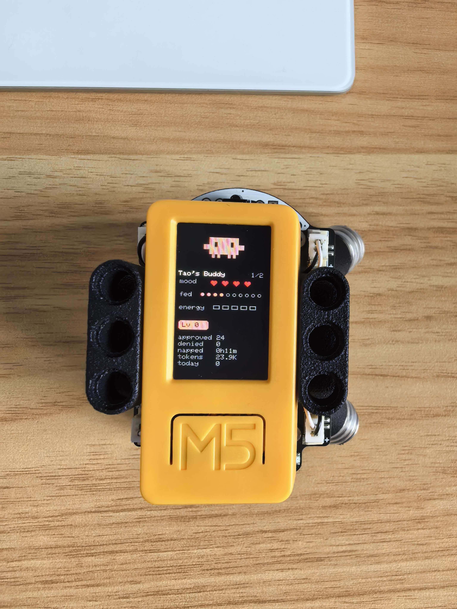

# claude-desktop-buddy (Plus2 + BugC2 fork)

Fork of [`anthropics/claude-desktop-buddy`](https://github.com/anthropics/claude-desktop-buddy)
extended for **M5StickC PLUS2 + BugC2 chassis**, with the Claude crab
("clawd") as the default mascot.

What this fork adds on top of upstream:

| | Upstream | This fork |
|---|---|---|
| Stick variant | M5StickC / Plus | **+ Plus2** (via M5Unified migration; AXP192 deadlock fixed) |
| Default species | capybara (ASCII) | **crab** (Claude mascot, ASCII) |
| GIF pet | bufo example | **clawd pack** built from [`rullerzhou-afk/clawd-on-desk`](https://github.com/rullerzhou-afk/clawd-on-desk) — 8 states |
| Pet base | — | **BugC2 chassis** integration: 4 DC motors via I2C (0x38) drive on persona-state, 2× RGB LEDs as mood lighting |
| Tooling | `flash_character.py` | + **`tools/motor-calib.html`** — Web Bluetooth motor pattern calibrator (sliders + WASD + 16 sign-combo presets) |
| GIF pipeline | global bbox (over-padded small poses) | **per-state bbox** (each pose fills its canvas); TARGET_W 96 → 120 |

> The original Anthropic protocol docs in **[REFERENCE.md](REFERENCE.md)**
> still apply unchanged — this fork is a hardware extension, not a protocol
> change. Stick still talks plain Nordic UART to Claude desktop.

<p align="center">
  
</p>

## Hardware

This fork targets:

- **M5StickC Plus2** controller (Plus and original StickC also build via the
  M5Unified runtime check, but Plus2 is the primary; see notes in `m5_compat.h`)
- **BugC2 chassis** (optional) — programmable robot base, 4 DC motors,
  2 RGB LEDs, STM32F030F4P6 over I2C 0x38

Stick boots fine without BugC2 — the chassis driver probes 0x38 at startup
and skips silently if not present.

## Flashing

```bash
pio run -e m5stickc-plus2 -t upload
```

If you're starting from a previously-flashed device, wipe first:

```bash
pio run -e m5stickc-plus2 -t erase && pio run -e m5stickc-plus2 -t upload
```

Or wipe from the device itself: **hold A → settings → reset → factory reset**.

## Pairing

Same as upstream: enable **Help → Troubleshooting → Enable Developer Mode**,
then **Developer → Open Hardware Buddy…** in Claude desktop, click
**Connect**, pick the stick. macOS will prompt for Bluetooth permission once.

<p align="center">
  
  
</p>

## Controls

|                         | Normal               | Pet         | Info        | Approval    |
| ----------------------- | -------------------- | ----------- | ----------- | ----------- |
| **A** (front)           | next screen          | next screen | next screen | **approve** |
| **B** (right)           | scroll transcript    | next page   | next page   | **deny**    |
| **Hold A**              | menu                 | menu        | menu        | menu        |
| **Power** (left, short) | toggle screen off    |             |             |             |
| **Power** (left, ~6s)   | hard power off       |             |             |             |
| **Shake**               | dizzy                |             |             | —           |
| **Face-down**           | nap (energy refills) |             |             |             |

The screen auto-powers-off after 30s of no interaction (kept on while an
approval prompt is up). Any button press wakes it.

## ASCII pets

Nineteen species, each with seven animations (sleep, idle, busy, attention,
celebrate, dizzy, heart). **Crab** (Claude mascot) is the default. Menu →
"next pet" cycles them with a counter; choice persists to NVS.

## GIF pets

The default GIF pack is **clawd**, with all sprite art credit to
[`rullerzhou-afk/clawd-on-desk`](https://github.com/rullerzhou-afk/clawd-on-desk)
— a delightful collection of pixel-art Claude crab animations originally
made as a desk companion. Huge thanks to
[@rullerzhou-afk](https://github.com/rullerzhou-afk) for the art; we
just resize and remap it onto the buddy's persona-state engine here.

| Our state | Clawd GIF | Preview |
|---|---|---|
| `sleep` | `clawd-sleeping.gif` |  |
| `idle` | `clawd-idle.gif` |  |
| `busy` | `clawd-thinking.gif` |  |
| `attention` | `clawd-error.gif` |  |
| `celebrate` | `clawd-juggling.gif` |  |
| `dizzy` | `clawd-conducting.gif` |  |
| `heart` | `clawd-happy.gif` |  |

To use your own pack: drag the folder onto the Hardware Buddy window
(streams over BLE), or for fast iteration:

```bash
python3 tools/prep_character.py /path/to/source-gifs
python3 tools/flash_character.py characters/<name>
```

A character pack is a folder with `manifest.json` and source GIFs at any
size. `prep_character.py` resizes to **120px wide** (was 96 upstream — the
larger size makes idle/sleep poses readable on Plus2's 135×240 screen).
Each state cropped to its **own bbox**, not a global bbox — small poses
(idle/sleep) no longer get padded out to match the widest pose
(juggling/conducting).

```json
{
  "name": "clawd",
  "colors": { "body": "#D97757", "bg": "#000000", ... },
  "states": {
    "sleep": "clawd-sleeping.gif",
    "idle":  "clawd-idle.gif",
    ...
  }
}
```

State values can be a single filename or an array; arrays rotate so the
home screen doesn't loop one clip forever.

The whole folder must fit under 1.8MB. `gifsicle --lossy=80 -O3 --colors 64`
typically cuts 40–60% if you bust the cap.

## BugC2 chassis (optional)

If you mount the stick on a BugC2 base, the firmware drives the chassis
to mirror the buddy's persona state:

| Persona state | BugC2 motion + LED                                              |
|---------------|------------------------------------------------------------------|
| `sleep`       | motors off, LEDs off                                             |
| `idle`        | motors off, LEDs dim cyan                                        |
| `busy`        | 1.2s in-place spin + 3-chirp ascending bleep (900/1300/1700 Hz) |
| `attention`   | 80ms twitch every ~1.2s, amber LED breathing pulse              |
| `celebrate`   | continuous gentle spin, green LEDs                              |
| `dizzy`       | quick alternating spin, yellow LEDs (capped at 600ms)           |
| `heart`       | pink heartbeat (thump-thump) on LEDs + occasional small wiggle  |

I2C protocol verified verbatim against `m5stack/M5Hat-BugC@c054b6e`. The
driver uses Arduino `Wire` (I2C_NUM_0) at 400 kHz on G0/G26 — **not** `Wire1`
which would collide with M5Unified's IMU/RTC bus.

### Manual motor calibration

`tools/motor-calib.html` is a Web Bluetooth page that connects to the stick
over the existing NUS service and sends raw 4-channel motor commands
(`{"cmd":"motor","s":[a,b,c,d]}`). Useful for figuring out which channel
drives which wheel, finding the FORWARD pattern, and tuning per-side speed
trim if your motors are asymmetric.

```bash
cd tools
python3 -m http.server 8765
open http://localhost:8765/motor-calib.html
```

Connect, then sliders / WASD / preset buttons send commands. Auto-stop
after 1500ms of no keepalive. Manual mode suspends the persona-state
mapping so the operator owns the chassis.

## The seven states

| State       | Trigger                     | Feel                        |
| ----------- | --------------------------- | --------------------------- |
| `sleep`     | bridge not connected        | eyes closed, slow breathing |
| `idle`      | connected, nothing urgent   | blinking, looking around    |
| `busy`      | session actively running    | thinking, working           |
| `attention` | approval pending            | alert, **LED blinks**       |
| `celebrate` | level up (every 50K tokens) | confetti, bouncing          |
| `dizzy`     | you shook the stick         | spiral eyes, wobbling       |
| `heart`     | approved in under 5s        | floating hearts             |

> Heads up: this fork lowers the `busy` threshold from `running >= 3` to
> `running >= 1`, so a single session counts as busy and the BugC2 chassis
> reacts. Stick semantics otherwise unchanged.

## Project layout

```
src/
  main.cpp       — loop, state machine, UI screens
  buddy.cpp      — ASCII species dispatch + render helpers
  buddies/       — one file per species, seven anim functions each
                   (now includes crab.cpp = Claude mascot, default)
  ble_bridge.cpp — Nordic UART service, line-buffered TX/RX
  character.cpp  — GIF decode + render (per-state bbox aware)
  bugc2.{h,cpp}  — BugC2 chassis driver + persona-state motion catalog
  m5_compat.h    — Plus / Plus2 cross-board API shim (M5Unified)
  data.h         — wire protocol, JSON parse (incl. {"cmd":"motor",...})
  xfer.h         — folder push receiver
  stats.h        — NVS-backed stats, settings, owner, species choice
characters/      — bufo (upstream), clawd (this fork)
tools/
  prep_character.py   — resize source GIFs to 120px / per-state bbox
  flash_character.py  — fast USB uploadfs path (skips BLE)
  motor-calib.html    — Web Bluetooth BugC2 calibrator
mac-helper/      — Swift package: clipboard sync helper
.omc/            — OMC tooling state (gitignored)
```

## TODO

Roadmap for this fork (PRs welcome):

- [ ] **Claude Code CLI bridge** — desktop-side daemon that consumes
      Claude Code hooks (SessionStart / PreToolUse / Stop / Notification)
      and pushes the same heartbeat protocol over BLE NUS, so the buddy
      reacts to terminal sessions the way it does to Claude desktop
      sessions today. Plan in `.omc/plans/crab-and-cli-bridge.md`.
      Stick firmware needs zero changes — just a producer.
- [ ] **Re-enable audio capture / BLE PTT** on Plus2. Currently disabled
      in `setup()` because the I2S init burns ~68KB heap that the 16-bit
      sprite needs. Need to either drop sprite to 8-bit palette or use
      a smaller I2S buffer.
- [ ] **More GIF packs** from `clawd-on-desk` — calico, cloudling.
      `tools/prep_character.py` already supports per-state bbox so each
      pack lights up cleanly. Just write a manifest.
- [ ] **BugC2 LED-as-status overlay** — LEDs currently mirror persona
      state mood. Could double as a token-rate indicator: brightness
      proportional to recent tokens/sec.
- [ ] **Auto-calibration** for BugC2 motor asymmetry. Manual tool exists
      (`tools/motor-calib.html`); a one-shot self-test that drives a
      known pattern and uses IMU yaw drift to compute trim would be
      better than the current "click 8 buttons and eyeball straightness".
- [ ] **Land a turn-around pacing motion** — initial attempt was
      forward → 180° → forward; calibration was finicky (battery sag
      changes the 180° duration). Replaced with a simple in-place spin.
      A self-calibrating turn (use IMU yaw to close the loop) would
      revive the original idea.
- [ ] **Cliff detection** — BugC2 has no cliff sensor and the chassis
      can walk off a desk during translation. For now we accept the
      risk; an ultrasonic / IR add-on or a hard travel-distance cap
      with IMU integration would harden it.

Out of scope (researched, not feasible without hardware change):

- ~~Jumping / hopping~~ — BugC2 spec confirms no actuator beyond 4 DC
  motors + 2 RGB LEDs. The "springs" visible on the chassis are passive
  wheel suspension, not driven elements.

## Availability

The BLE API is only available when the desktop apps are in developer mode
(**Help → Troubleshooting → Enable Developer Mode**). It's intended for
makers and developers and isn't an officially supported product feature.

This fork is independently maintained — for upstream's reference protocol
docs see **[REFERENCE.md](REFERENCE.md)**.

## Credits

This fork stands on the shoulders of:

- **[`anthropics/claude-desktop-buddy`](https://github.com/anthropics/claude-desktop-buddy)**
  — the upstream firmware: state machine, BLE bridge, GIF runtime, ASCII
  sprite engine, character pack pipeline. Everything below the BugC2
  layer is upstream's design; we only added Plus2 board support, the
  crab species, and the chassis driver on top.

- **[`rullerzhou-afk/clawd-on-desk`](https://github.com/rullerzhou-afk/clawd-on-desk)**
  by [@rullerzhou-afk](https://github.com/rullerzhou-afk) — every clawd
  pixel-art animation in this fork's GIF pack. The Claude crab is from
  this collection; we just resize it and map each pose onto our
  PersonaState. If you like clawd, go star their repo — there are
  many more poses (calico, cloudling, building, sweeping, carrying…)
  that are easy to wire up by editing `tools/clawd-src/manifest.json`.

- **[`m5stack/M5Hat-BugC`](https://github.com/m5stack/M5Hat-BugC)**
  — official BugC/BugC2 chassis library. Used as the
  ground-truth wire-protocol reference; we copied the I2C register map
  and motion patterns verbatim from `examples/bugc_robot_test/`.

- **[`m5stack/M5Unified`](https://github.com/m5stack/M5Unified)**
  — cross-board API that made M5StickC Plus2 compatibility a 1-day
  port instead of a 1-week one.
