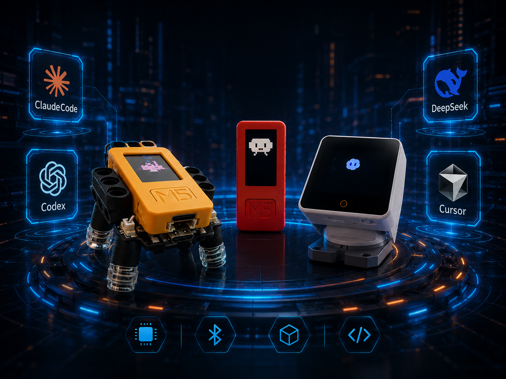
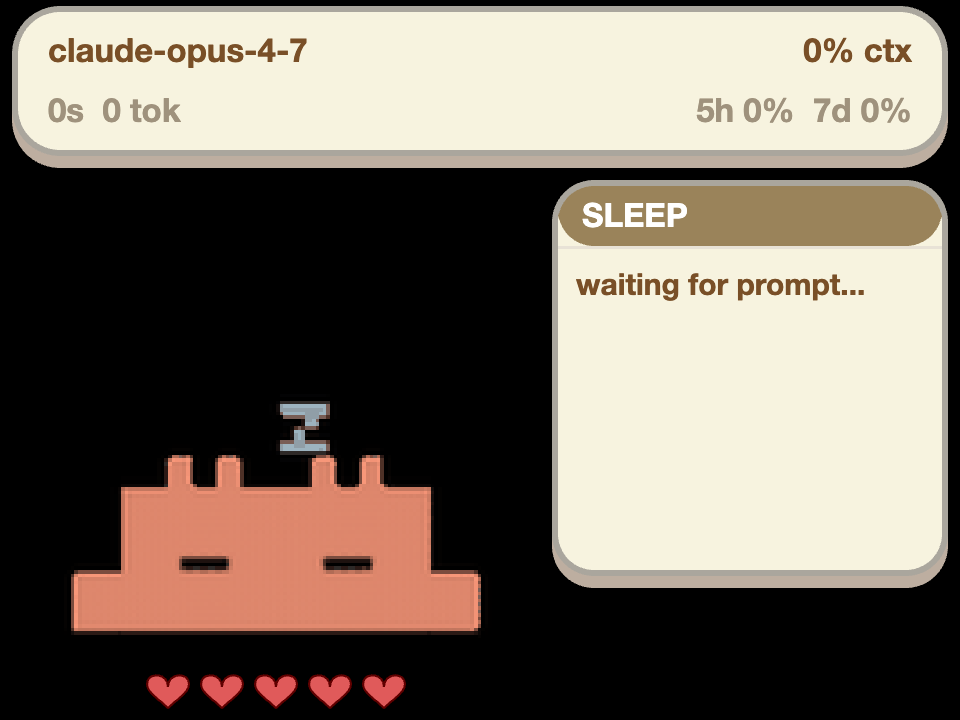
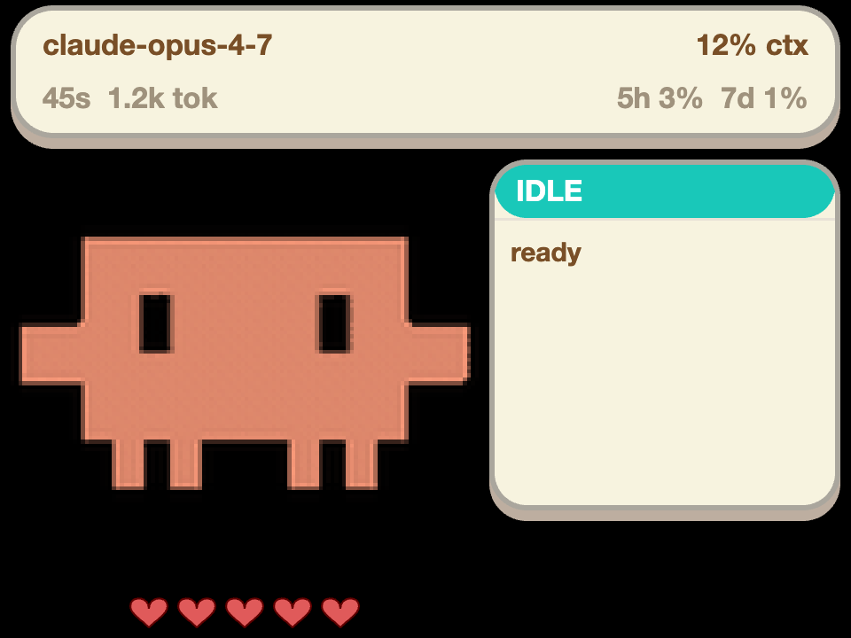
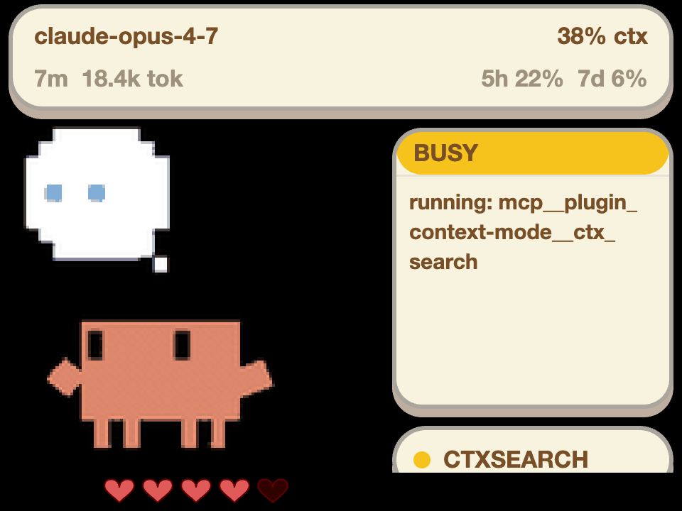
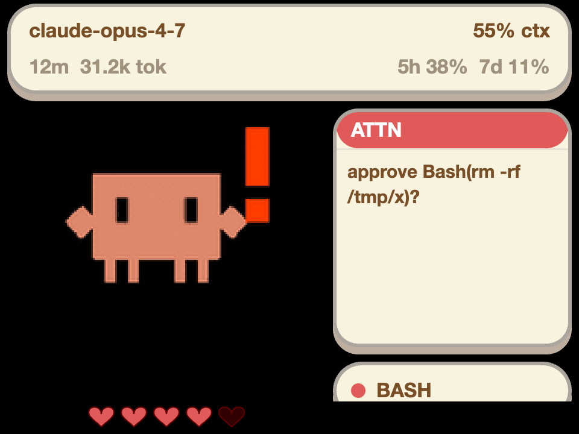
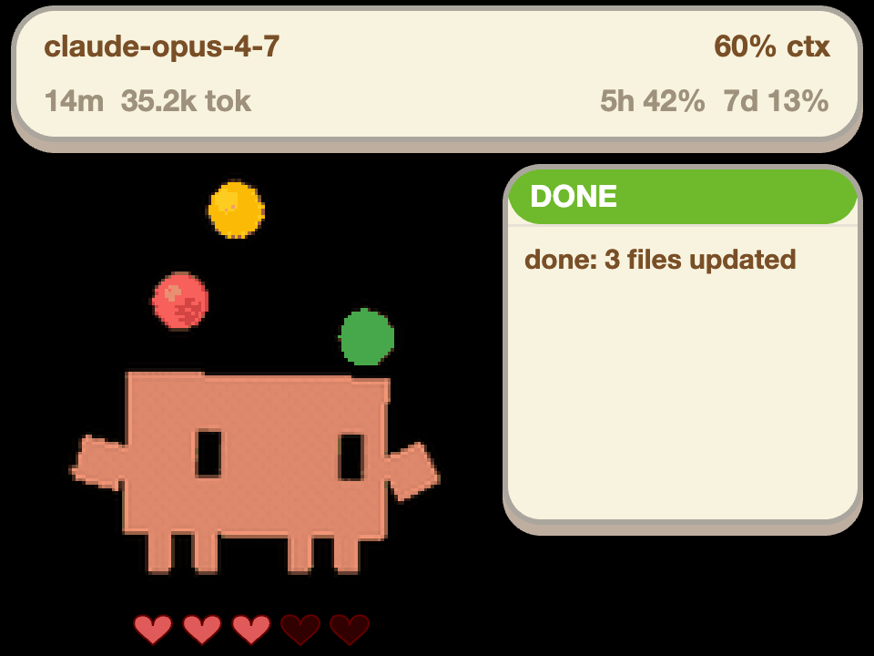

# claude-code-buddy

<p align="center">
  
</p>

Firmware + Mac daemons that mirror an AI coding session onto **M5 hardware**.
Two firmware targets share one wire protocol; three IDE producers feed
them: Claude Desktop (the upstream GUI), Claude Code (CLI), and Cursor
(IDE). Pick a lane, flash, pair — your stick now reacts to your assistant.

> **Want the whole picture?** [`docs/architecture.md`](docs/architecture.md)
> has system-overview, sequence, state-machine, and file-map diagrams.
> Wire-protocol contract: [`REFERENCE.md`](REFERENCE.md).

## What's in the box

| Target | Form factor | Highlights |
|---|---|---|
| **M5StickC Plus2** | 1.14" pocket stick, optional [BugC2](docs/bugc2.md) chassis | Buttons, PTT mic gesture, dance-on-state, permission echo |
| **M5Stack StackChan (CoreS3)** | 2.0" LCD desktop pet, servos + 12 RGB LEDs + 1W speaker + GC0308 camera | Voice clips on hook events, dance patterns, localhost dashboard, hands-free **gesture approve** (thumbs-up / thumbs-down)* |

\* The gesture path is wired end-to-end but rendered dormant until
`wifi_secrets.ini` is filled and the `[vision]` extra is installed.
Manual approval keeps working without either. See
[StackChan camera gestures](#stackchan-camera-gestures).

| IDE producer | Implementation | Mac side |
|---|---|---|
| Claude Desktop | upstream in-app BLE bridge | none |
| Claude Code (CLI) | `tools/cc-bridge/` — Python daemon + hooks + localhost dashboard | launchd, ~40 MB RAM |
| Cursor (IDE) | `tools/cursor-bridge/` — Python daemon + Node shim | launchd |

Two daemons + two sticks coexist by BLE-name prefix (`Claude-` vs `Cursor-`).

## Quick start

Prereqs: macOS, an M5StickC Plus2 *or* an M5Stack StackChan (CoreS3),
[PlatformIO Core](https://docs.platformio.org/en/latest/core/installation/methods/)
(`brew install platformio`).

```bash
# Plus2 stick + Claude Desktop (the simplest path)
pio run -e m5stickc-plus2-claude -t upload -t uploadfs
# In Claude Desktop:
#   Help → Troubleshooting → Enable Developer Mode
#   Developer → Open Hardware Buddy → Connect

# Plus2 stick + Claude Code (CLI)
pio run -e m5stickc-plus2-claude -t upload -t uploadfs
tools/cc-bridge/install.sh

# Plus2 stick + Cursor IDE
pio run -e m5stickc-plus2-cursor -t upload -t uploadfs
tools/cursor-bridge/install.sh
```

For the `-claude` / `-cursor` lanes you must also **pair once** via
*System Settings → Bluetooth* (six-digit passkey shows on the stick).
After that the launchd daemon auto-reconnects within ~10 s of every
wake.

StackChan has [its own flashing section](#stackchan-cores3) below.

## Hardware

**M5StickC Plus2** — 1.14" 135×240 LCD, 240 MHz ESP32, IMU, buzzer.
Plus and original StickC also build via `m5_compat.h`, but Plus2 is
the primary target. Optional **[BugC2](docs/bugc2.md)** chassis adds 4
DC motors and 2 RGB LEDs over I²C 0x38 — driver probes the address
at boot, so the stick boots fine without it.

**M5Stack StackChan (CoreS3)** — ESP32-S3, 16 MB flash, 8 MB PSRAM,
2.0" touch LCD, GC0308 front camera. Body BSP: 2 feedback servos
(X continuous 360°, Y 90°), 12 RGB LEDs, 1 W speaker, 3-zone touch,
IR, NFC, INA226 power monitor. Plays preloaded ElevenLabs voice clips
on hook events (sources:
[`shanraisshan/claude-code-hooks`](https://github.com/shanraisshan/claude-code-hooks)).
Configurable from a localhost dashboard at `http://127.0.0.1:18765/`
(persists to NVS).

> The CoreS3 camera shares an I²C bus with the speaker amp, RTC, IMU,
> and touch — see [the I²C-conflict diagram](docs/architecture.md#6-cores3-hardware-quirks-shared-i2c-bus)
> for what that means in practice.

## Flashing

Five PlatformIO envs. Pick by hardware **and** producer:

| Env | Hardware | BLE name | Default char | Use with |
|---|---|---|---|---|
| `m5stickc-plus2-claude`    | Plus2  | `Claude-XXXX`     | `clawd` | Claude Desktop or cc-bridge |
| `m5stickc-plus2-cursor`    | Plus2  | `Cursor-XXXX`     | `clawd` | cursor-bridge |
| `m5stickc-plus2`           | Plus2  | `Claude-XXXX`     | auto    | legacy / no defaults |
| `cores3-stackchan-claude`  | CoreS3 | `Claude-SC-XXXX`  | `clawd` | cc-bridge |
| `cores3-stackchan-cursor`  | CoreS3 | `Cursor-SC-XXXX`  | `clawd` | cursor-bridge |

```bash
# Firmware AND character pack in one shot — the Makefile has shortcuts
make flash-claude   # equals: pio run -e m5stickc-plus2-claude -t upload -t uploadfs
make flash-cursor

# To wipe a previously-flashed device first
pio run -e m5stickc-plus2-claude -t erase \
  && pio run -e m5stickc-plus2-claude -t upload -t uploadfs
```

Skipping `uploadfs` on a fresh stick boots to a no-character screen —
easy to silently miss.

Two sticks attached at once? See
[`docs/onboarding-next-stick.md`](docs/onboarding-next-stick.md) —
pin each env to its USB port via `upload_port` in `platformio.ini`.

## StackChan (CoreS3)

Same wire protocol as the Plus2, with a richer renderer (320×240 face
GIF + ACNH-style status panel), voice clips through the speaker, and
two-axis dance patterns. Plus an experimental camera path described
below.

### What the UX looks like

The five state-machine faces, rendered by the firmware on the CoreS3 LCD
(captured via the [companion macOS app](desktop-app/) — see below):

| State | Frame | Trigger |
|---|---|---|
| **SLEEP** |  | >20s without heartbeat |
| **IDLE** |  | daemon connected, no running tools |
| **BUSY** |  | tool is running (msg shows tool name) |
| **ATTN** |  | permission prompt pending |
| **DONE** |  | post-tool celebrate (3s hold) |

The top ACNH-style cream card is the OMC-HUD (model · ctx % · session ·
tokens · 5h/7d limits). The right bubble carries the state header +
word-wrapped msg. The pill below is the active tool chip. The five
hearts under the character are battery level — each heart = 20 %, Zelda
style.

### Try it without the hardware

`desktop-app/` is an Electron port of the same renderer — pixel-for-pixel
geometry, same GIF assets, same ACNH palette — so you can dogfood the
UX before flashing a CoreS3.

```bash
cd desktop-app
npm install
npm start              # mock cycles SLEEP→IDLE→BUSY→ATTN→DONE
npx electron capture.js  # re-renders the screenshots above
```

It currently runs against a built-in mock event stream; wiring it to
the live `cc-bridge` socket so it becomes a virtual StackChan peer is a
future iteration.

### Flash

```bash
pio run -e cores3-stackchan-claude -t upload -t uploadfs \
  --upload-port /dev/cu.usbmodem<NN>
```

CoreS3 enumerates as USB CDC, so the port name is `usbmodem*` (not
the `usbserial-*` that the Plus2 uses).

### Point cc-bridge at it

```xml
<!-- ~/Library/LaunchAgents/com.cc-bridge.plist EnvironmentVariables -->
<key>CC_BRIDGE_DEVICE_PREFIX</key>
<string>Claude-SC-</string>                <!-- StackChan only -->
<!-- or to drive Plus2 + StackChan at once: -->
<string>Claude-F7C2,Claude-SC-</string>
```

Reload: `launchctl unload && launchctl load ~/Library/LaunchAgents/com.cc-bridge.plist`.

### Dashboard

`http://127.0.0.1:18765/` — sliders for volume / brightness, dropdown
for character pack, toggles for motion + idle wiggle, tilt setpoint.
Settings persist via NVS. Set `CC_BRIDGE_DASH_PORT=0` in the plist to
disable.

### Sound clips

WAVs for all hook events live under `data/sounds/`. Resampled to 16 kHz
mono 16-bit so the full set fits LittleFS. Drop a new
`<eventname>.wav` in and re-run `uploadfs` — firmware enumerates the
directory at boot, no rebuild needed.

### StackChan camera gestures

A permission prompt sets `state.prompt` on the daemon, which sets
ATTENTION on the StackChan, which starts the camera, which streams
JPEG frames over WiFi to the daemon, which runs MediaPipe Hands on
each frame, which sends a confirmed gesture (`approve` / `deny`) back
over BLE, which makes the firmware emit the matching permission ack
that resolves the Claude Code prompt. End-to-end flow:
[diagram](docs/architecture.md#5-camera-gesture-pipeline-stackchan-new).

To enable:

```bash
# 1. install the heavy CV stack into the daemon venv (~50 MB)
~/.cc-bridge/venv/bin/pip install -e ".[vision]"

# 2. edit wifi_secrets.ini — fill ssid, pass, host (your Mac LAN IP)
#    then keep your credentials out of git:
git update-index --skip-worktree wifi_secrets.ini

# 3. re-flash firmware (build-time creds bake in)
pio run -e cores3-stackchan-claude -t upload --upload-port /dev/cu.usbmodem<NN>

# 4. restart the daemon
launchctl kickstart -k gui/$(id -u)/com.cc-bridge
```

If you skip any step, the gesture path stays dormant and **manual
approval still works** — nothing breaks. The camera is gated to the
prompt window only (privacy + bounds the I²C-bus side effect).

## Pairing

**Claude Desktop**: Help → Troubleshooting → Enable Developer Mode,
then Developer → Open Hardware Buddy → Connect.

<p align="center">
  
  
</p>

**cc-bridge / cursor-bridge**: pair once via *System Settings →
Bluetooth → Other devices* — pick `Claude-XXXX` / `Cursor-XXXX` and
enter the six-digit passkey shown on the stick. After the bond the
launchd daemon auto-reconnects.

Logs: `~/Library/Logs/cc-bridge.log` / `~/Library/Logs/cursor-bridge.log`.
Stale bond? "Forget This Device" in Bluetooth settings + re-pair.

## Deep dives

- **[Architecture diagrams](docs/architecture.md)** — system overview,
  one-tick sequence, daemon task graph, firmware state machine,
  camera-gesture pipeline, CoreS3 I²C bus conflict, file map.
- **[Wire-protocol reference](REFERENCE.md)** — heartbeat schema,
  BLE UUIDs, command vocabulary.
- **[Plus2 controls](docs/controls.md)** — button map (standard +
  no-B mode), PTT dictation gesture, per-app PTT mode picker
  (Typeless / Doubao 长按 / 免按), screen-off semantics.
- **[Character packs](docs/character-packs.md)** — built-in packs
  (clawd, calico, bufo, cloudling), `manifest.json` shape, the
  pack-prep pipeline.
- **[BugC2 chassis](docs/bugc2.md)** — per-state motion + LED catalog,
  I²C protocol notes, manual motor calibration via Web Bluetooth.
- **[Persona states](docs/states.md)** — the seven states and their
  per-target output mapping.
- **[Onboarding another stick](docs/onboarding-next-stick.md)** —
  flash gotchas, per-stick USB port pinning, running two bridges in
  parallel.
- **[Original camera-feature proposal](docs/proposals/stackchan-camera.md)**
  — the opinionated doc that became the gesture-approve feature.
- **[OpenSpec specs](openspec/specs/)** — formal behaviour specs
  (`daemon-event-mapping`, `camera-gesture-pipeline`).

## Project layout

```
src/                 — Plus2 firmware (main.cpp, bugc2, character, ble_bridge, data)
src/stackchan/       — CoreS3 firmware (main, character_chan, sound, motion,
                       settings, camera_chan, wifi_stream, frame_framing,
                       camera_arm, permission_ack)
tools/
  buddy_core/        — shared daemon library (BuddyState, BleWriter, run(),
                       frame_server, frame_deframer, hand_gesture,
                       gesture_classifier)
  cc-bridge/         — Claude Code daemon + dashboard.py
  cursor-bridge/     — Cursor daemon + Node hook shim
desktop-app/         — Electron port of the StackChan renderer (mock-driven
                       UX preview + screenshot capture; see StackChan section)
test/                — pio native unit tests (color_util, frame_framing,
                       camera_arm, permission_ack)
tests/               — pytest (daemon library, both bridges, statusline,
                       frame deframer, frame server, gesture classifier,
                       hand gesture)
characters/          — source GIFs: clawd / calico / bufo / cloudling
data/                — staged LittleFS contents (gitignored, uploadfs source)
docs/                — deep-dive references
openspec/            — formal spec management (changes/, specs/, archive/)
platformio.ini       — 5 build envs (3 Plus2 variants + 2 CoreS3 variants)
mac-helper/          — Swift clipboard-sync helper
wifi_secrets.ini     — tracked placeholder; per-machine overrides via
                       `git update-index --skip-worktree`
```

## What's distinctive about this fork

(vs. upstream [`anthropics/claude-desktop-buddy`](https://github.com/anthropics/claude-desktop-buddy).)

- **Two new Mac-side producers**: `tools/cc-bridge/` (Claude Code CLI)
  and `tools/cursor-bridge/` (Cursor IDE). Both run as launchd
  daemons; both reuse the upstream BLE protocol verbatim.
- **Permission echo** on cc-bridge: stick button A approves a
  `PreToolUse` prompt, B denies — synchronous, no UX hop through the
  IDE's permission dialog.
- **PTT dictation gesture**: stick sends `{"cmd":"mic","state":"…"}`
  on tap-then-hold-A; daemon relays as a configurable keystroke
  (Typeless, Doubao 长按 / 免按).
- **CoreS3 / StackChan target**: full desktop-pet firmware, plus the
  optional camera-gesture pipeline described above.
- **Stale-session reaper** in both bridges: counter drift caused by
  dropped `Stop` / `SessionEnd` hooks self-heals within 10 min.
- **One-shot RTC sync** on BLE reconnect — without it the stick clock
  sits at 2000-01-01 because nothing else sends the periodic time frame.
- Two PlatformIO envs (`-claude` / `-cursor`) pin BLE name, default
  character pack, and (optionally) USB port per stick.
- **Clawd GIF pack** as the default character — both Plus2 and
  StackChan ship with it.

The full timeline of merged behaviour changes lives in
[OpenSpec archives](openspec/changes/archive/).

## Status & roadmap

Living list of recently shipped + open items:
**[`docs/roadmap.md`](docs/roadmap.md)**. Contributions welcome —
small focused PRs land fastest, see the deep-dives + architecture doc
to orient.

## Availability

The upstream BLE API is only exposed when the desktop apps are in
developer mode. It's intended for makers and developers, not an
officially supported product feature.

This fork is independently maintained.

## Credits

- **[`anthropics/claude-desktop-buddy`](https://github.com/anthropics/claude-desktop-buddy)**
  — upstream firmware: state machine, BLE service, GIF runtime,
  persona engine, character pack pipeline.
- **[`rullerzhou-afk/clawd-on-desk`](https://github.com/rullerzhou-afk/clawd-on-desk)**
  — clawd and cloudling sprite art.
- **[`shanraisshan/claude-code-hooks`](https://github.com/shanraisshan/claude-code-hooks)**
  — ElevenLabs "Samara X" voice clips.
- **[`m5stack/M5Hat-BugC`](https://github.com/m5stack/M5Hat-BugC)** —
  BugC/BugC2 chassis library, copied verbatim as the I²C ground truth.
- **[`m5stack/M5Unified`](https://github.com/m5stack/M5Unified)** —
  cross-board API that made the Plus + Plus2 port a one-day job.
- **[`GOB52/M5StackCoreS3_CameraWebServer`](https://github.com/GOB52/M5StackCoreS3_CameraWebServer)**
  + **[`GOB52/gob_GC0308`](https://github.com/GOB52/gob_GC0308)** —
  pinned upstream for the CoreS3 GC0308 bring-up sequence used by
  the camera-gesture path.
- **[Google MediaPipe](https://developers.google.com/mediapipe)** —
  HandLandmarker model + Tasks API powering on-Mac gesture recognition.
