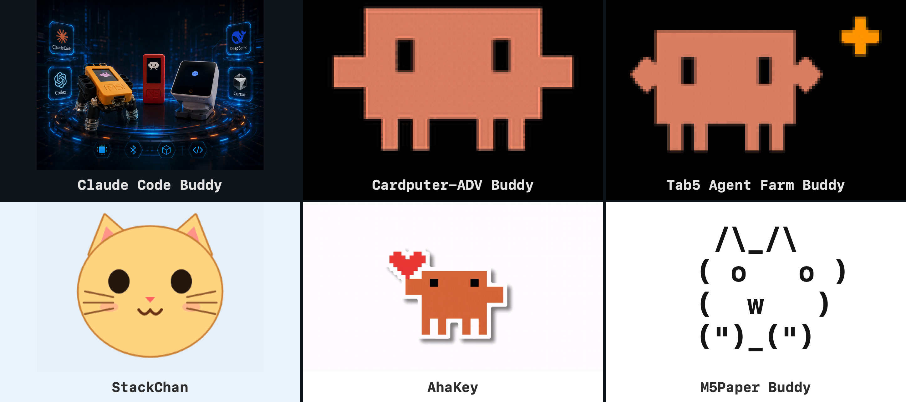

# hardware-buddies

把 AI 编程助手（Claude Code / Cursor / Codex / OpenCode / Kimi Code）的会话状态，映射到桌面上一件件实体硬件的 monorepo。每个子目录是一个独立产品，通过 `git subtree`（**保留各自完整 git 历史**）从原仓库引入。

<p align="center">
  
</p>

## 这些产品在做什么

同一件事：**IDE / AI agent 的状态 → 实体硬件的表情与动作**。

- 屏幕上的角色随会话状态变化：running → 忙碌，等待审批 → 求关注，完成 → 庆祝，空闲 → 打盹。
- 物理按键 / 拨杆 / 键盘就是工具审批的开关——不看屏幕也能批准或拒绝一次工具调用。
- Mac 侧的 bridge daemon（`cc-bridge` 家族）把 IDE hook 事件翻译成统一的会话状态 JSON，经 BLE 或 USB 串口推给设备。

## 子项目

| 目录 | 产品 | 硬件 | 技术栈 | 状态 |
|---|---|---|---|---|
| [`claude-code-buddy/`](./claude-code-buddy) | **旗舰** —— 多形态桌面伴侣 + Mac bridge 守护进程（cc-bridge / cursor-bridge / codex-bridge / opencode-bridge） | M5StickC Plus2 / CoreS3 StackChan / Tab5 / StickS3 / RoverC | ESP32 (PlatformIO) + Python | 活跃 |
| [`cardputer-adv-buddy/`](./cardputer-adv-buddy) | Cardputer-ADV 上的 Claude Code 伴侣，实体键盘审批 | Cardputer-ADV (ESP32-S3) | ESP32-S3 (PlatformIO) | 活跃 |
| [`tab5-agentfarm-buddy/`](./tab5-agentfarm-buddy) | Agent Farm 桌宠，**USB 串口**供数（P4 无射频） | M5 Tab5 (ESP32-P4) | ESP32-P4 (PlatformIO) + Python bridge | 活跃 |
| [`stackchan-firmware/`](./stackchan-firmware) | StackChan 固件 + ESP-IDF 语音助手（Agora） | CoreS3 StackChan | PlatformIO + ESP-IDF | 活跃 |
| [`stackchan-standup-buddy/`](./stackchan-standup-buddy) | StackChan 站立提醒器：定时摇头唱歌，摸头确认 | CoreS3 StackChan | ESP32-S3 (PlatformIO) | 活跃 |
| [`stopwatch-walkie/`](./stopwatch-walkie) | 按住说话、通过 Mac bridge 转写的腕上对讲机原型 | M5 StopWatch (ESP32-S3) | ESP32-S3 (PlatformIO) + Python bridge | 开发中 |
| [`ahakey/`](./ahakey) | AhaKey-X1 键盘伴侣：OLED + LED 灯条反映 IDE 状态，拨杆审批 | AhaKey BLE 键盘 | Swift + SwiftUI (macOS) | 活跃 |
| [`m5-paper-buddy/`](./m5-paper-buddy) | 墨水屏桌面伴侣（第三方上游 `op7418/m5-paper-buddy` 的快照） | M5Paper | ESP32 (PlatformIO) | **冻结**（只同步上游，不重构） |

每个子项目有自己的 CLAUDE.md / README / HANDOFF 文档，改动前先读对应目录的文档。跨项目的共享架构（cc-bridge 线协议、state→avatar 映射、硬件坑清单）见根目录 [`CLAUDE.md`](./CLAUDE.md)，操作向的速查见 [`AGENTS.md`](./AGENTS.md)。

## 构建

各子项目**不共享构建**，先 `cd` 进子目录：

```bash
cd claude-code-buddy    && pio run -e <board-env>     # 旗舰，env 见 platformio.ini
cd cardputer-adv-buddy  && pio run -e cardputer-adv
cd tab5-agentfarm-buddy && pio run -e tab5-agentfarm  # uploadfs / upload 分两条命令
cd stackchan-firmware   && pio run                    # voice-agent/ 是独立 ESP-IDF 工程
cd stackchan-standup-buddy && pio run -e cores3-standup  # uploadfs / upload 分两条命令
cd stopwatch-walkie     && pio run -e m5stack-stopwatch
cd m5-paper-buddy       && pio run -e m5paper
cd ahakey/platforms/macos && swift build              # 不是根 Makefile（已过时）
```

## 历史与同步说明

- 每个子目录通过 `git subtree add --prefix=<dir> <repo> main` 引入，**完整保留原始提交历史**（`git log <dir>/` 可看到原 commit）。
- `m5-paper-buddy/` 如需跟上游更新：`git subtree pull --prefix=m5-paper-buddy <upstream> main`。
- 引入新子项目：`git subtree add --prefix=<目录名> <repo-url> <branch>`。
