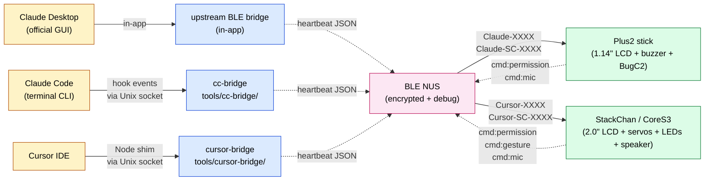
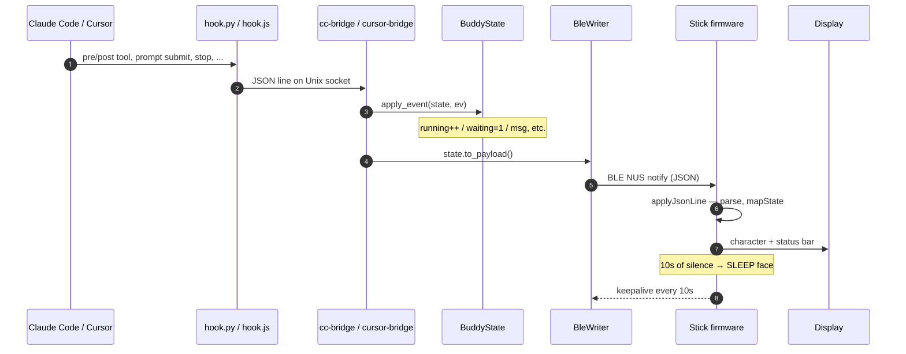
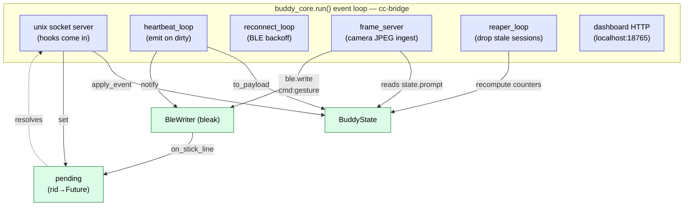
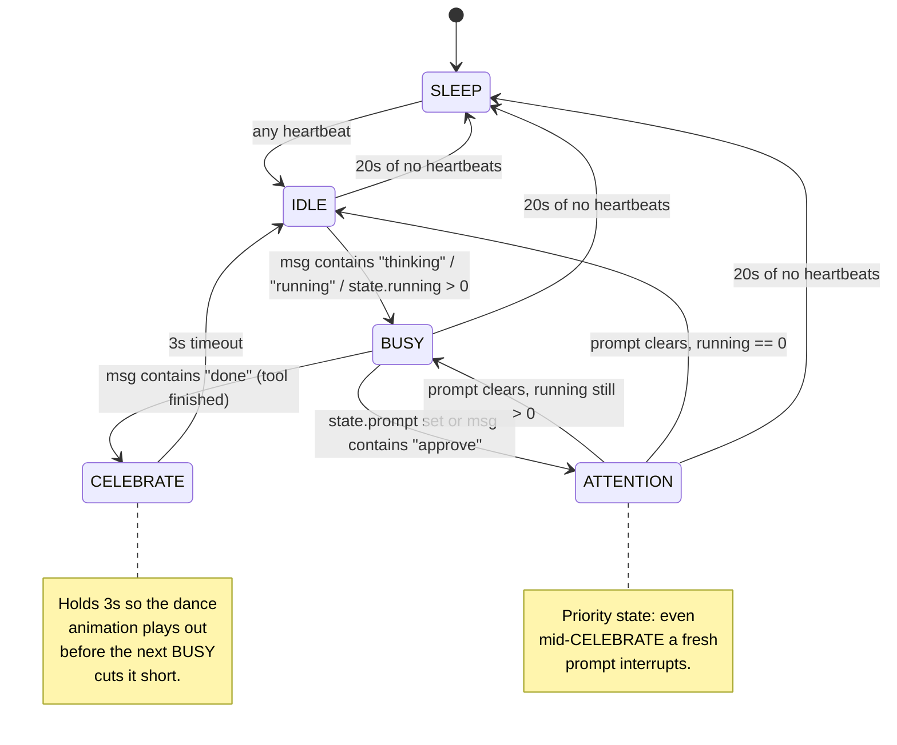
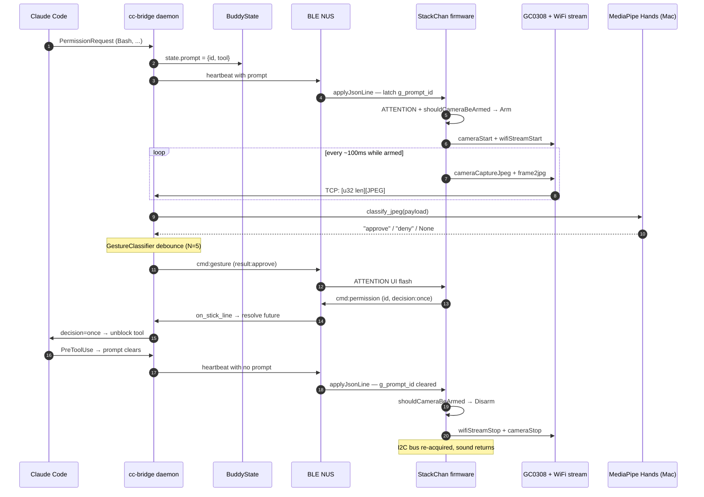
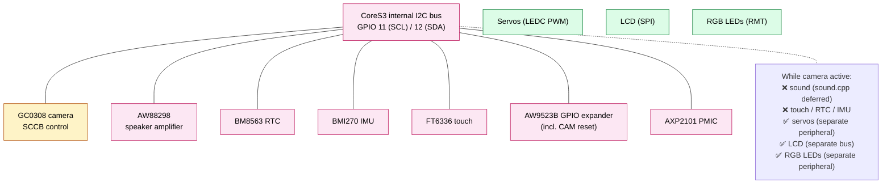
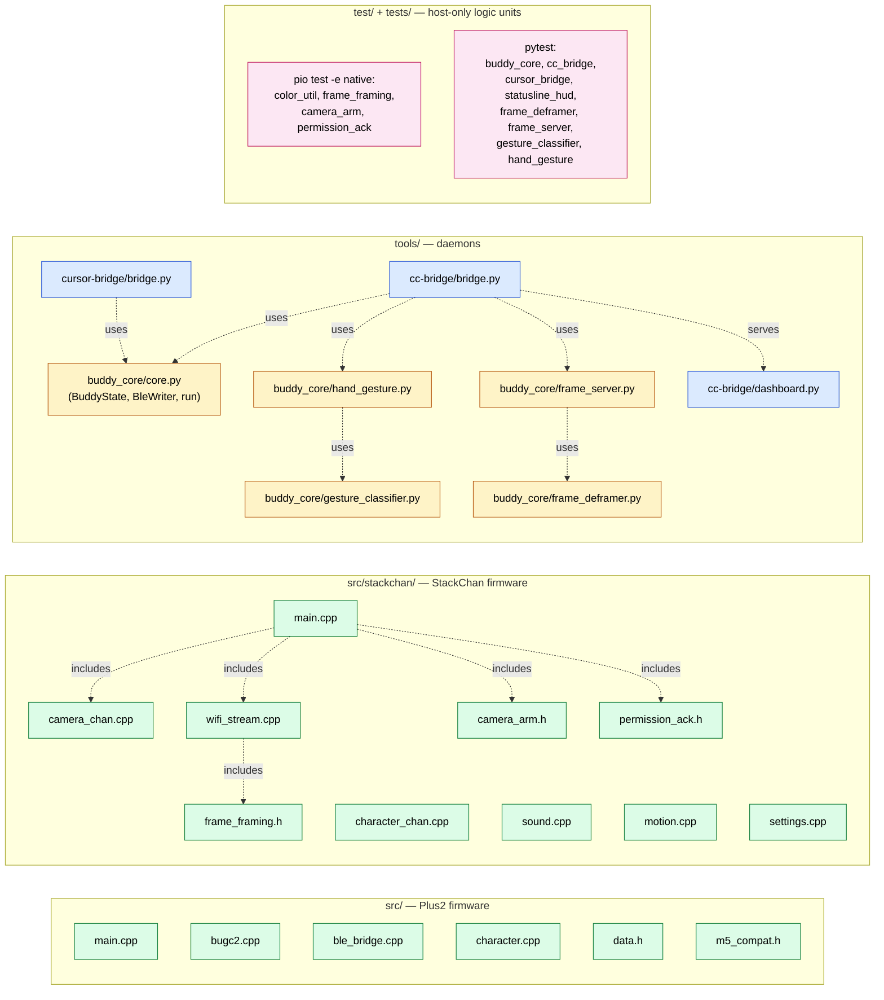

# Architecture

This is the "how the whole thing fits together" doc — diagrams of the
data paths, daemon process model, firmware state machine, and the new
camera-gesture pipeline. Use it as a map when you're trying to find the
right module to change.

For surface-level details (how to flash, pair, wire) see the [README](../README.md).
For the wire-format contract see [REFERENCE.md](../REFERENCE.md).

---

## 1. System overview

Every supported IDE producer (Claude Desktop, Claude Code CLI, Cursor)
ultimately drives the same firmware over the same Nordic UART BLE
service. The differences live in how Mac-side events get turned into
the heartbeat payload the stick expects.

The daemons pick which stick to talk to via the BLE advertising name
prefix (`Claude-`, `Cursor-`). Two daemons running side by side never
fight because they scan for different prefixes.

---

## 2. One heartbeat tick

When a hook event arrives at the daemon, the daemon mutates `BuddyState`
(`tools/buddy_core/core.py`) and emits a fresh JSON line to the stick.
The stick parses the line, maps it to a character state, and updates
the display.

The "lifecycle" events (`UserPromptSubmit`, `Stop`, `PreToolUse`,
`PostToolUse`, `PermissionRequest`, `SessionEnd`) drive the persona
state machine. `hud` events are pure telemetry — they carry
context-window %, token counts, rate-limit % from Claude Code's
statusline stdin and never touch session lifecycle counters.

---

## 3. The daemon process model

`buddy_core.run()` is the shared shell every daemon shares. Each daemon
plugs IDE-specific behaviour (`apply_event`, optional extra tasks) into
it via injection. cc-bridge currently has the richest set of tasks
because it also runs the localhost dashboard and the camera frame
ingest server.

Key invariants worth remembering when changing daemon code:

- **Dirty flag**: any task can set `dirty` to force the next heartbeat
  emit immediately. Otherwise heartbeat runs on its 10-second keepalive
  schedule.
- **Single BLE writer**: only `BleWriter.write` touches the stick —
  every task funnels through it.
- **Permission acks come back**: the stick sends
  `{"cmd":"permission","id","decision"}` via BLE NUS TX. `on_stick_line`
  resolves the matching `pending[rid]` future, which unblocks the
  `_handle_wait_permission` coroutine and answers Claude Code.

---

## 4. Firmware state machine

The stick is a state machine driven by the daemon's heartbeat. Seven
states, one renderer per target hardware.

State → output mapping per target:

| State | Plus2 sprite | BugC2 motion | StackChan face | StackChan body |
|-------|--------------|--------------|----------------|----------------|
| SLEEP | sleeping zZz | motors off | sleep gif | servos home, idle wiggle off |
| IDLE | idle blink | gentle LED breathing | idle gif | head tilt, optional wiggle |
| BUSY | working | slow forward nudge | busy gif | small nods |
| ATTENTION | alert | LEDs strobe yellow | attention gif | look-left-right |
| CELEBRATE | jump | spin in place + LEDs cycle | celebrate gif | 4× yaw swing + look-up |
| DIZZY | wobble | wiggle | dizzy gif | tilt off-axis |
| HEART | heart eyes | warm LED pulse | heart gif | gentle bob |

---

## 5. Camera gesture pipeline (StackChan, new)

The camera is **gated** — only runs while a permission prompt is
pending. This bounds the I2C-bus side effect (see §6) and is the privacy
posture for the feature.

The "wire decision" string is `"once"` for approve and `"deny"` for
deny — this is what `_handle_wait_permission` replies to Claude Code,
matching the existing Plus2 A-button approve flow. Firmware emits the
ack (not the daemon) so the firmware stays the single source of truth
for "the user, at the device, decided X".

If `wifi_secrets.ini` still has placeholder credentials, the
`shouldCameraBeArmed` check short-circuits and the camera never even
starts — no I2C release, no speaker mute, no failed WiFi associate
per prompt. Manual approval (Desktop GUI, etc.) keeps working.

---

## 6. CoreS3 hardware quirks: shared I2C bus

The GC0308 camera's SCCB control lines live on GPIO11/12 — which is
**also the internal system I2C bus** on the CoreS3. Pinned upstream
firmware ([GOB52/M5StackCoreS3_CameraWebServer](https://github.com/GOB52/M5StackCoreS3_CameraWebServer))
solves this by calling `M5.In_I2C.release()` before camera init so
esp32-camera privately owns those two GPIOs. That works, but while it's
in effect M5Unified can't reach any of these chips:

Mitigation in the firmware:
- **`cameraStop()`** calls `M5.In_I2C.begin()` to reacquire the bus on
  prompt-clear. Speaker, touch, RTC all come back.
- **`sound.cpp`** treats playback as unavailable during the camera
  window — calls become no-ops or get deferred.
- **Camera window is short** (the duration of one permission prompt,
  typically a few seconds), so the side effect is bounded.

The reset pin for the GC0308 is on the AW9523B GPIO expander
(P1_0 = CAM_RST), but **upstream's firmware doesn't touch it** — the
plain `M5.begin()` brings up the AW9523 and releases the camera reset
as part of CoreS3 board init. We follow the same pattern (`pin_pwdn =
-1`, `pin_reset = -1`).

---

## 7. File map

The repo is split into firmware (C++), daemons (Python), and prep
tooling. The diagram below shows the modules that get touched most.

The dashed arrows are "imports / includes". The four host-testable
headers in `src/stackchan/` (`camera_arm.h`, `permission_ack.h`,
`frame_framing.h`, plus `color_util.h` shared with `src/`) keep the
firmware seam thin enough that the native test env covers the logic
without an ESP32 board.

---

## See also

- [REFERENCE.md](../REFERENCE.md) — wire-format contract (heartbeat
  schema, BLE service UUIDs, command vocabulary).
- [docs/states.md](states.md) — persona state machine semantics.
- [docs/controls.md](controls.md) — Plus2 button + gesture map.
- [docs/proposals/stackchan-camera.md](proposals/stackchan-camera.md) —
  the original opinionated proposal that became the camera-gesture
  feature.
- [openspec/specs/](../openspec/specs/) — formal specs in OpenSpec
  format (`daemon-event-mapping`, `camera-gesture-pipeline`).
