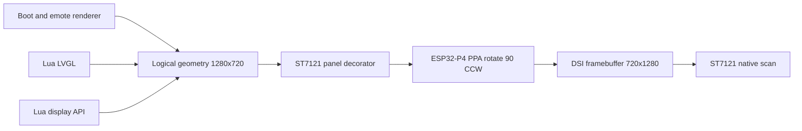
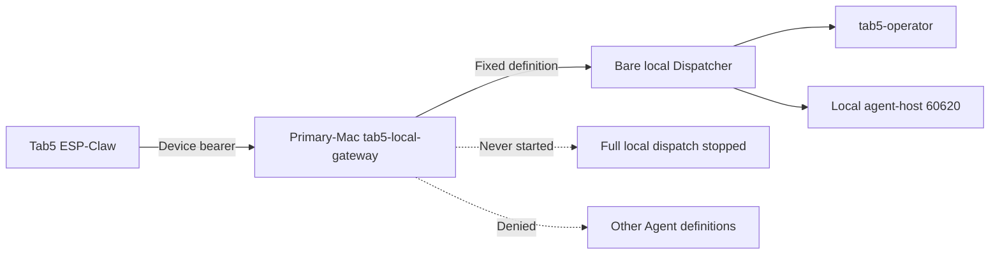
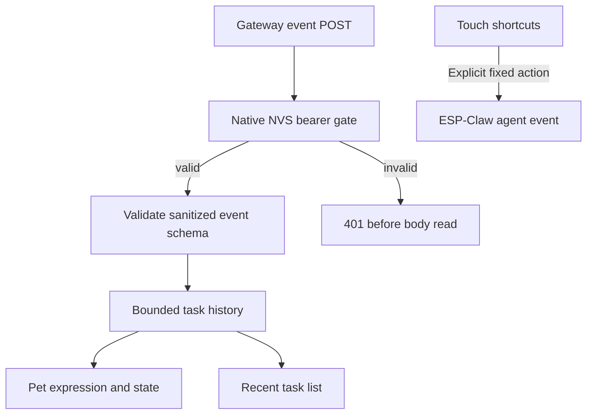

## Context

The physical device is a 2026-04+ M5Stack Tab5 (ESP32-P4 v1.3, ST7121 LCD,
ST7123 touch) identified by MAC `80:f1:b2:d1:51:7d`. It runs ESP-Claw from
`/Users/txie/OpenSourceProjects/esp-claw`, not the
`claude-code-buddy/src/tab5/` USB dashboard firmware.

The ST7121 scans natively at 720×1280 and does not implement
`esp_lcd_panel_swap_xy()`. ESP-Claw has three independent drawing paths—emote,
Lua LVGL, and Lua display—but all ultimately call the same panel
`draw_bitmap`. ST7123 reports physical 720×1280 coordinates.

The selected Agent Farm path is local to the Primary MacBook. Its `agent-host`
already runs on loopback, while the full local dispatch remains deliberately
stopped to avoid consuming the same Feishu bot as another control plane. The
Tab5 therefore uses a dedicated bare Dispatcher process with no Feishu channel,
cron, sweep, dashboard administration, or warm-pool startup.

An earlier Mac2 scoped-route path was implemented and validated, but it is not
the selected production topology. Mac2 configuration is explicitly outside this
integration's control.

## Goals / Non-Goals

**Goals:**

- Present the entire ESP-Claw experience as a correct 1280×720 landscape UI
  when the Tab5's USB/power connector is on the left.
- Keep display pixels and all touch consumers in one logical coordinate system.
- Use Agent Farm through a dedicated identity and least-privilege network
  surface.
- Display Agent Farm lifecycle events without invoking an LLM for each event.
- Permit free-form chat through ESP-Claw's standard OpenAI-compatible provider
  path and a small set of explicit touch shortcuts.
- Fail closed when credentials, definitions, upstream services, or the device
  are unavailable.
- Make each layer independently stoppable and reversible.

**Non-Goals:**

- Changing the existing `claude-code-buddy/src/tab5/` firmware, USB NDJSON
  protocol, cc-bridge, or Agent Farm Feishu routing.
- Giving the device dashboard administration, direct agent-host access, config
  mutation, rotate/refill, approval, or arbitrary-definition dispatch.
- Implementing true run cancellation; Agent Farm does not currently provide it.
- Giving `tab5-operator` high-risk MCP tools in the initial release.
- Running the LLM locally on ESP32-P4.
- Adding an on-device full keyboard or production voice input in this change.

## Decisions

### 1. Rotate once at the ST7121 panel boundary

All renderers use a logical 1280×720 surface. The ST7121 driver decorates the
underlying MIPI-DPI panel's `draw_bitmap`, uses the ESP32-P4 PPA in blocking
RGB565 mode, writes the rotated rectangle directly into the native 720×1280 DSI
framebuffer, then invokes the original draw completion path.



The physical DSI timing remains 720×1280. Partial rectangles retain the
caller's original input stride; clipping happens in logical space before the
rectangle is mapped into physical space. A display geometry registry exposes
1280×720 to emote and Lua board-manager consumers.

ST7123 coordinates are transformed at the board touch factory, before LVGL or
Lua touch APIs see them:

```text
logical_x = 1279 - raw_y
logical_y = raw_x
```

This is the inverse of the selected 90° CCW pixel rotation and matches the
USB-left physical orientation.

The ST7121 variant defaults backlight duty to 40 percent. The previous
ESP-Claw value was a true 100 percent LEDC duty, whereas the known-cooler SSH
firmware used `M5.Display.setBrightness(100)` on a 0–255 scale (about 39
percent). Physical A/B testing confirmed that continuous PPA refresh contributes
some heat, but full backlight power is the dominant source of USB-C-area
temperature.

**Alternatives considered:**

- Swapping DSI `h_size` and `v_size`: rejected because those are physical panel
  timings and causes invalid scanout.
- `lv_display_set_rotation()` alone: rejected because it does not rotate pixels
  and would miss emote and Lua display.
- Per-renderer rotation: rejected because it duplicates three implementations
  and inevitably drifts from touch mapping.
- Upgrading ESP-IDF for the newer DPI draw hook: deferred; IDF 5.5.4 is already
  proven on this hardware, and the local panel decorator is smaller risk.

### 2. Run a bare local Dispatcher, not the full local dispatch service

The dedicated `tab5-local-gateway` loads the local Agent Farm configuration and
constructs only `EnginePool`, isolated `StateStore`, and `Dispatcher`. It does
not call runtime warm-up, start Feishu, register cron, start a dynamic-agent
sweep, or expose dashboard administration.



The gateway subscribes to the same in-process event bus used by the local
Dispatcher. It reconstructs allowlisted events containing only version, event
type, phase, definition, safe agent ID, duration, progress character count, and
timestamp. Prompts, replies, sender identity, raw errors, filesystem paths,
config, and secrets are omitted.

**Alternatives considered:**

- Start the full local dispatch: rejected because it can duplicate Feishu
  consumption and run unrelated cron/pool work.
- Depend on Mac2 scoped routes: rejected by user direction; Tab5 should connect
  to the current MacBook and remain independent of Mac2 config drift.
- Call agent-host directly and reimplement lifecycle: rejected because the bare
  Dispatcher already provides create/resume/rotation semantics.

### 3. Keep the local gateway fail-closed

The local gateway has two independent features:

- Chat: OpenAI-compatible `POST /v1/chat/completions`, fixed model identity,
  latest-user-message forwarding, one in-flight request, explicit streaming,
  bounded body size, and generic upstream errors.
- Events: in-process sanitization plus `off` and `forward` modes.

Defaults are fail-closed: bind `127.0.0.1`, disable chat, and disable event
forwarding. LAN bind, chat, and forwarding each require explicit configuration.
The device receives no dashboard or agent-host token. The local process reads
the agent-host secret from its own environment and holds separate device-facing
chat and event tokens.
Forward mode also emits a sanitized `link/heartbeat` event every five seconds
so device connectivity does not incorrectly become stale while Agent Farm is
idle.

### 4. Use ESP-Claw's standard provider path for free-form chat

When chat is enabled, ESP-Claw's OpenAI-compatible Base URL points at the
Primary-Mac gateway. The API key is the device-facing gateway token. The gateway
ignores request `model` and always uses `tab5-operator`.

ESP-Claw continues to own conversation UX, session selection, and response
rendering. Agent Farm owns the long-lived agent context. Only the newest user
message is forwarded because the resumed Agent Farm agent already retains its
own history.

### 5. Run the terminal as one cooperative Lua application

The landscape terminal is a packaged ESP-Claw Skill with one long-running Lua
job that owns LVGL, touch, local task history, and the event HTTP route. The
Lua HTTP server gains:

- access to the request `Authorization` header; credentials are not accepted in
  the JSON body;
- a bounded `app:poll(timeout_ms)` API so one loop can alternate HTTP request
  dispatch with `lvgl.process_events()` and touch handling;
- `app:require_bearer_setting("af_dev_token")`, which makes the native HTTP
  handler load the expected token from NVS and reject unauthorized requests
  before reading their body or enqueueing them to Lua.

The device event token is stored in NVS, not in the FAT filesystem or Skill
source. Lua declares which NVS setting protects its app but never receives the
setting value or bearer header. After the native gate succeeds, the Lua callback
accepts only the already-sanitized schema and keeps a bounded in-memory history;
malformed, unauthorized, duplicate, or unsupported events do not alter UI
state.



### 6. Use a two-column landscape interaction model

- Left region: large lobster/emote, connection state, current Agent/phase.
- Right region: active task plus a bounded recent-event list.
- Bottom region: safe fixed actions such as refresh/local status and opening the
  standard chat path.

Events update the UI locally and never wake the LLM. A real Agent Farm dispatch
occurs only for a user-submitted chat or an explicitly labeled touch action.
The UI never labels an action “cancel” because no true cancellation contract
exists.

### 7. Keep `tab5-operator` isolated

Initial definition:

- engine `local`;
- cwd `/Users/txie/OpenSourceProjects/hardware-buddies`;
- model `sonnet`;
- mode `ask`;
- independent `memory_key: tab5-operator`;
- `pool_size: 0`;
- no trigger and no MCP servers.

Adding `ask-agent` or any mutating capability is a later reviewed expansion.
The canary definition itself creates no Agent; creation happens only on the
first authorized dispatch.

## Risks / Trade-offs

- **[PPA rotation adds bandwidth and may tear]** → Use blocking PPA, one panel
  mutex, partial-area tests, owner-switch stress tests, and observe FPS/tearing
  on real hardware before accepting the UI.
- **[Full backlight power heats the USB-C conversion path]** → Default to 40
  percent, matching the previous SSH firmware's effective brightness, and retain
  a physical idle-temperature acceptance check.
- **[Touch transform can be mirrored or off by one]** → Validate four corners,
  center, edges, and drag direction with USB physically on the left.
- **[Input buffer overlaps the DSI framebuffer]** → Reject in-place rotated
  draws; current renderers use separate compact buffers.
- **[Gateway compromise]** → Mac2 validates a separate scoped token and fixed
  route semantics; gateway has no administrator or agent-host credential.
- **[Home-LAN device endpoint is exposed]** → Require a high-entropy bearer,
  store it in NVS, cap request size, and do not expose the device or gateway to
  the public Internet.
- **[Primary Mac or home IP changes]** → Reserve stable DHCP addresses for the
  Mac and Tab5; show disconnected state without blocking the local UI.
- **[Lifecycle events are ephemeral]** → Treat the in-process feed as status,
  not an audit log; retain bounded device history and provide an explicit
  refresh path for current state.
- **[Duplicate events after reconnect or retries]** → Deduplicate by a bounded
  event identity derived from type, definition, agent, phase, and timestamp.
- **[Agent Farm reply latency is visible]** → Show running/progress state and
  retain ESP-Claw's local thinking UX; do not synthesize fake replies.
- **[Two source repositories plus this coordination spec]** → Keep landscape,
  gateway, and UI commits separate; record exact source commits in the runbook.
- **[Current ESP-Claw Web UI has no LAN authentication]** → Do not expose port
  80 outside the trusted LAN and never place Agent Farm admin credentials on the
  device.

## Migration Plan

1. Build the ST7121 landscape firmware, verify compile, flash only after MAC
   `80:f1:b2:d1:51:7d` is confirmed, and validate boot logs and orientation.
2. Validate emote, LVGL, Lua display, four-corner touch, partial refresh, and
   display-owner switching.
3. Add `tab5-operator` to the local config with no trigger, MCP, or pool.
4. Start the bare local gateway in loopback-only, chat-disabled event mode;
   prove the full local dispatch remains stopped and zero dispatches occur.
5. Verify the local gateway can reach agent-host without exposing its secret to
   the device.
6. Implement and flash the authenticated device event endpoint and landscape
   terminal UI.
7. Enable event forwarding while chat remains disabled; verify sanitized events
   update the device without LLM calls.
8. Bind the gateway to the home LAN and enable chat only after the device bearer
   and fixed-definition checks pass.
9. Perform one explicitly authorized real dispatch, then verify request,
   Agent Farm trace, response, device state, and usage attribution.
10. Persist the gateway process only after the complete path is accepted.

Rollback is layered:

1. Disable chat and event forwarding or stop the standalone gateway.
2. Remove/disable the `tab5-operator` definition.
3. Leave the full local dispatch stopped; no Mac2 rollback is required.
4. Reflash ESP-Claw commit `c182a77` to restore the proven portrait firmware.

## Open Questions

- Should the first production touch action merely open/status the terminal, or
  submit one fixed `tab5-operator` prompt?
- Which stable Primary-Mac LAN address should be reserved for the device Base
  URL?
- Should the landscape/PPA extension be proposed upstream separately from the
  ST7121 board-support PR?
- Is on-device microphone input a later extension of this terminal or a
  separate capability with its own privacy and audio pipeline review?
